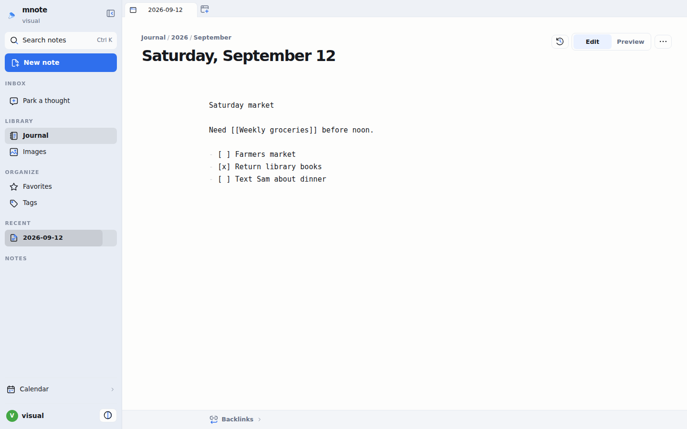
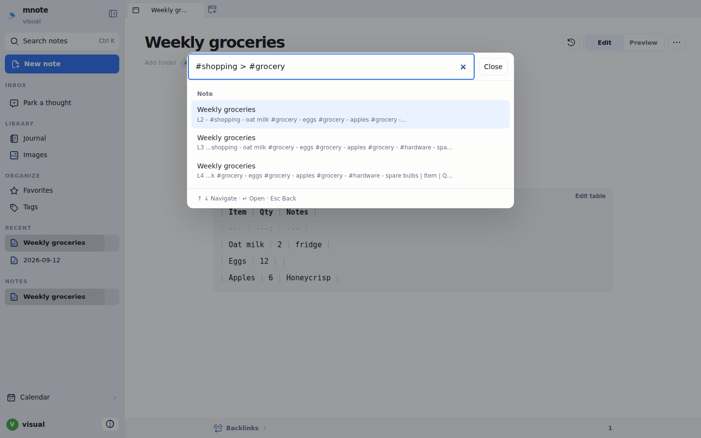
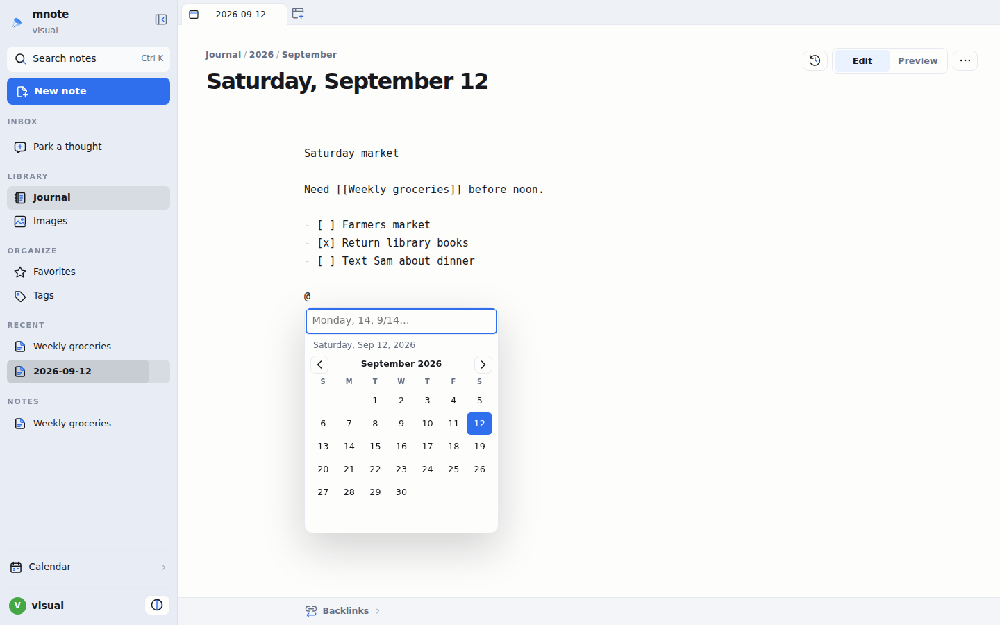
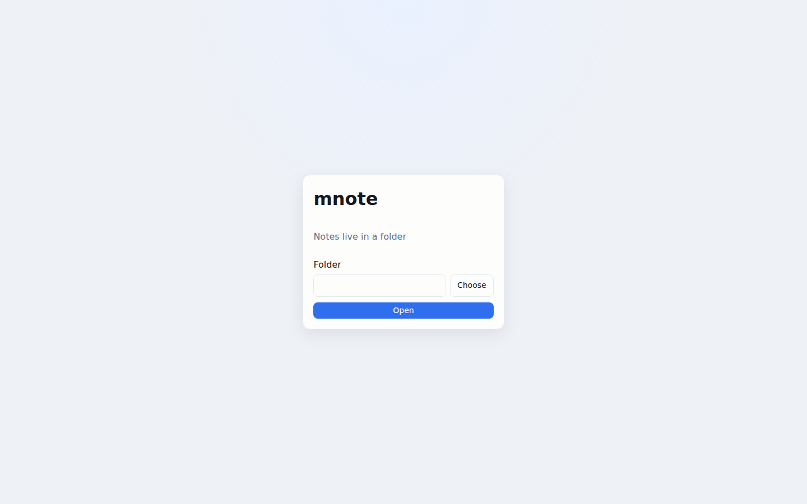
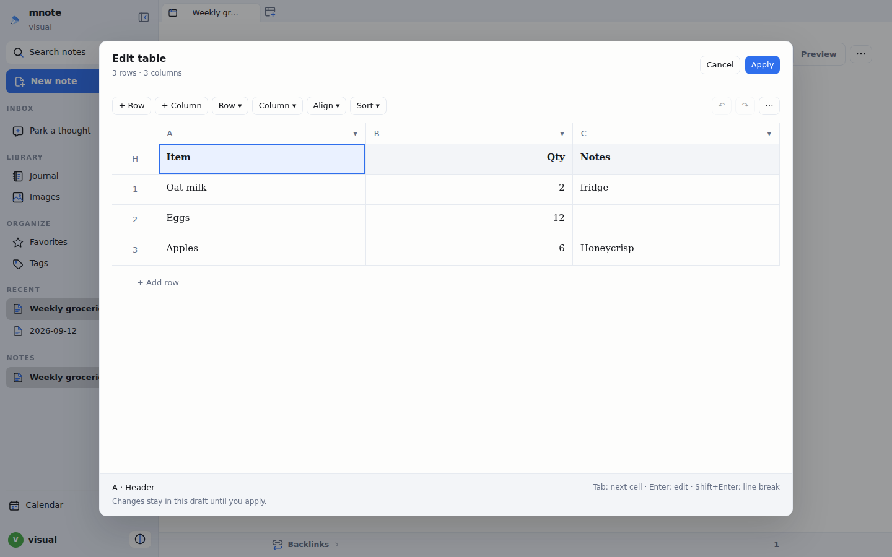
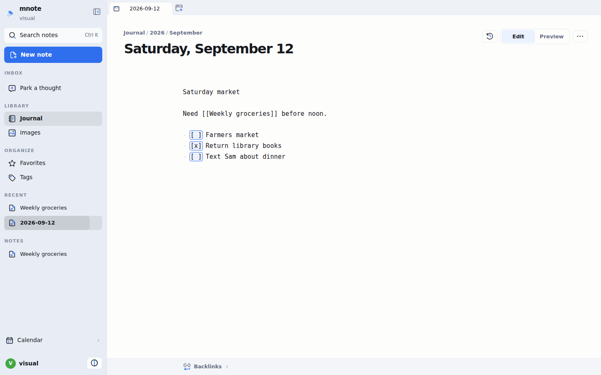
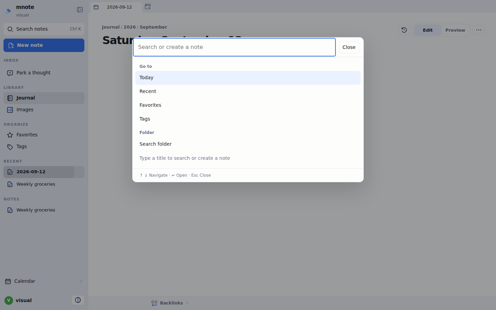
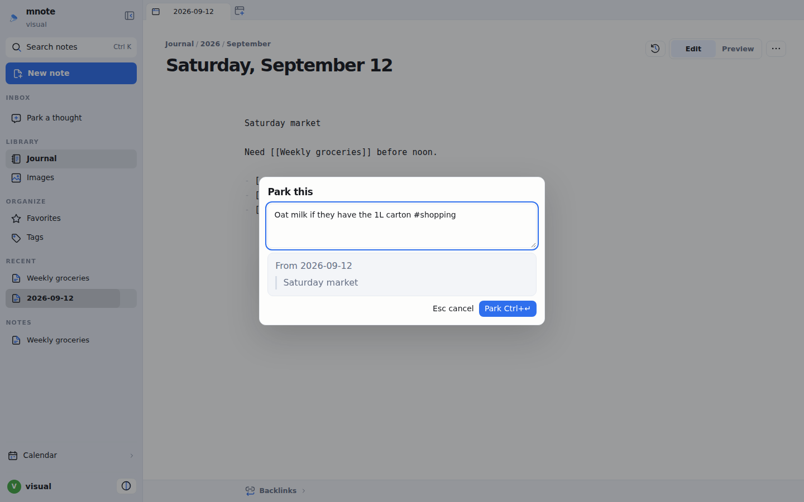
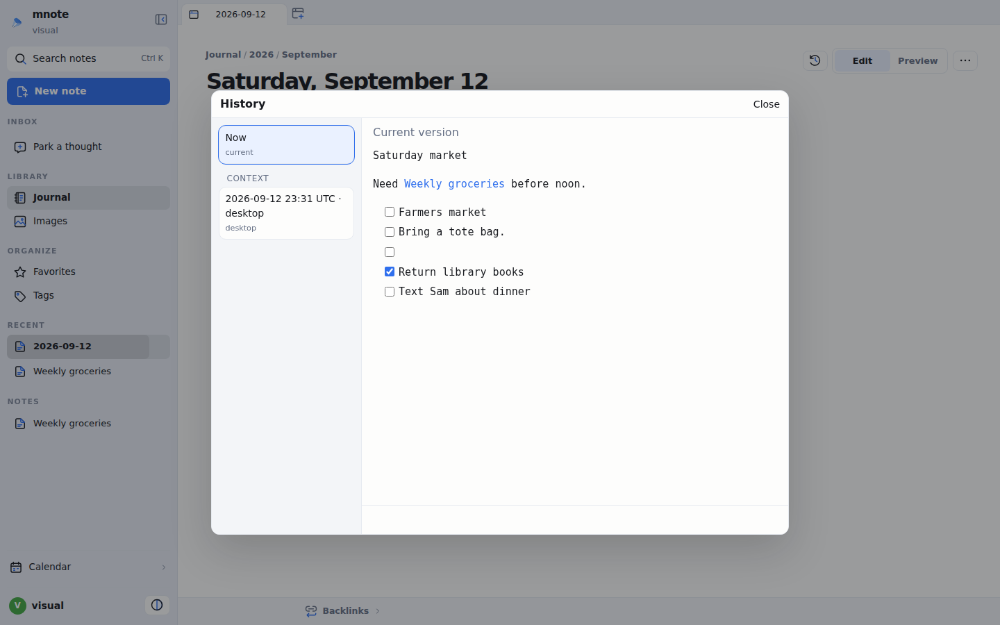
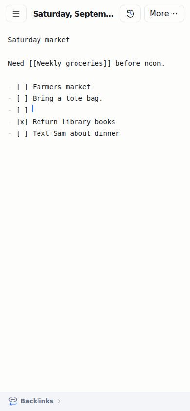

# mnote

Personal markdown notes. Each person has a private vault. The daily note is the inbox; other pages are freeform markdown with `[[wiki-links]]`.



## Highlights

1. **[Structured tag search](#structured-tag-search)** — `#shopping>#grocery` finds groceries only under `#shopping`.
2. **[Dates with @](#dates-with)** — type `@` to pick a date from the calendar or a short query.
3. **[One computer, no server](#one-computer-no-server)** — the desktop app is a folder. No host, login, or always-on process.
4. **[Table editor](#table-editor)** — edit a grid; mnote writes the markdown pipes.
5. **[Cmd-click checkboxes](#cmd-click-checkboxes)** — hold ⌘/Ctrl and click `[ ]` in source. No backspace-and-`x`.

## Structured tag search

Tags are hashtags in the note (`#shopping`), not a separate database. Nesting is by list or heading scope: a `#grocery` line under `#shopping` is found by `#shopping>#grocery` (same as `#shopping > #grocery` in the picker).

Open the picker (`⌘K` / Ctrl+K) and type the chain, or click Tags and walk into children with `>`.



## Dates with @

In the editor, type `@` after a space (not `alice@`). A calendar opens with a field: `mon`, `14`, `9/14`. Enter inserts the date. Click a day to insert without typing.



## One computer, no server

**mnote** (desktop): first screen is a folder picker. Open. Notes live in that folder. No username or password. Reopen the app → same folder.

Index and prefs stay in app data, not in the vault, so iCloud/Dropbox is not hit every keystroke.

Optional later: browser against a home host, or **mnote Remote** (`host:port` + invite login). Not required.



## Table editor

A GFM table in source is shaded. **Edit table** opens a grid. Sort, set alignment, add or remove rows and columns. Apply writes valid `| … |` markdown. You do not maintain column widths by hand.



## Cmd-click checkboxes

In **source** (not only preview): hold ⌘ (Ctrl on Linux/Windows) and click `[ ]` or `[x]`. Boxes light up while the modifier is held so the hit target is obvious. Preview still has normal click-to-toggle.



## Daily inbox

Today is `YYYY-MM-DD` at the vault root. The sidebar calendar opens any day’s journal. Source and preview; drag the mode toggle. `[[wiki-links]]` and `#tags` as chips after the folder.

`⌘K` / Ctrl+K finds or creates a page.



## Park a thought

Capture that is not a page yet (sidebar, More, or `⌘Enter`). Stamped with time / place / weather; promote to a note or dismiss.



## History

Snapshots per note on disk. Open History, preview a revision, restore.



## On a phone

One-row bar: Menu, title, More. Sidebar as overlay. Same vault in the browser.



## Your files

Notes are markdown on disk:

```
vault/
  notes/
  history/<note-id>/
  parked/
  context/
  assets/
```

Install, invite, Docker, and Electron packaging: [README.md](README.md).
