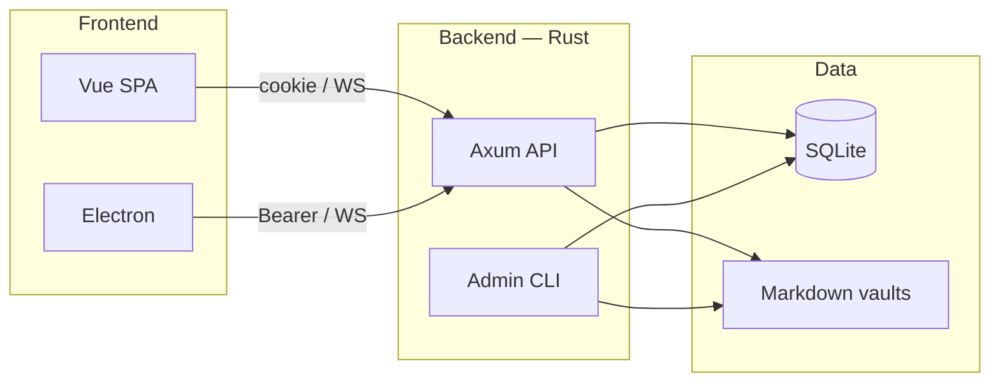
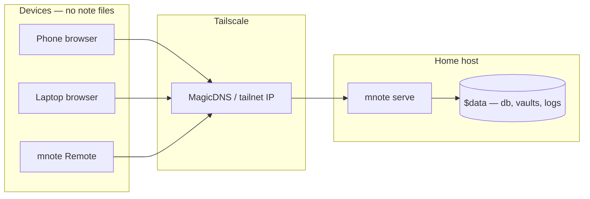

# mnote

Personal markdown notes for a small, locally hosted group (~10 users). Each person has a private vault. The daily note is the inbox; other pages are freeform markdown with `[[wiki-links]]`.



## Contents

- [Features](#features)
- [Data directory](#data-directory)
- [First-time users](#first-time-users)
- [Requirements](#requirements)
- [Development](#development)
- [Desktop (Electron)](#desktop-electron)
- [Tailscale](#tailscale)
- [Tests](#tests)
- [Production (single process)](#production-single-process)
- [Docker](#docker)
- [API (cookie session)](#api-cookie-session)

## Features

- **Self-hosted** — one process, one data folder, private vaults. Notes are markdown on disk.
- **Cross-device** — browser or Electron (local folder or remote server), same account.
- **Context logging** — time and place on paragraphs and parked captures, not stuffed into the note body. Weather from Open-Meteo is off unless `MNOTE_WEATHER=1`.
- **History** — snapshots per note; restore any revision.
- **Interaction** — daily inbox, park-and-capture, `[[wiki-links]]`, note picker, source + preview.

## Data directory

All persistent state lives under one folder (`MNOTE_DATA`, default `./data`). Mount this path as a Docker volume.

```
data/                      # bind-mount this
  db/mnote.db              # users, sessions, prefs, FTS, cache
  vaults/<user>/notes/     # markdown
  vaults/<user>/assets/    # images + map.json
  vaults/<user>/history/   # edit snapshots per note id
  vaults/<user>/parked/    # parked captures
  vaults/<user>/context/   # paragraph context JSON
  logs/mnote.log.YYYY-MM-DD
```

## First-time users

1. Admin creates an account and sends the printed invite to the person:

   ```bash
   cargo run -- --data data user add alice
   # docker: docker compose exec mnote mnote user add alice
   ```

   ```
   Created account 'alice'.

   Send them this:
     Open:                 http://127.0.0.1:3000
     Username:             alice
     Temporary password:   ...............

   They must choose a new password on first login.
   ```

2. They log in with that username and temporary password.
3. They are sent to **Set your password**. Notes stay locked until they choose a new one. Reusing the temporary password is rejected.

Forgot password: `cargo run -- --data data user reset-password alice` — same invite, same forced reset.

`MNOTE_PUBLIC_URL` (default `http://127.0.0.1:3000`) is what the invite prints as the open link.

## Requirements

- Rust 1.90+ (`cargo`)
- Node 22+ (`npm`)
- Docker with Compose, for the complete validation suite

## Development

From the repo root (kills anything already on :3000 / :5173, then starts both):

```bash
make dev
```

`make dev` binds the API on `0.0.0.0:3000`. Plain `mnote serve` listens on `127.0.0.1:3000`.

First time: `cd web && npm install`. Vite proxies `/api` to the Rust server and forwards the session cookie. Use the web app at http://127.0.0.1:5173.

```bash
# or two terminals
cargo run -- --data data serve
cd web && npm run dev
```

```bash
cargo run -- --data data user list
```

## Desktop (Electron)

Two apps share the Vue UI:

- **mnote Remote** — enter a server `host:port`, log in as usual (username + password).
- **mnote** — pick a local folder. No password or username. Reopening that folder opens the notes. Change or reveal the folder from the sidebar. Notes stay in that folder (`notes/`, `history/`, `parked/`, `context/`, `assets/`). Index and prefs live in app userData so cloud sync is not triggered by every keystroke. Serving a server data dir with `mnote serve` still requires a password.

```bash
make desktop-mac           # unpacked .app (arm64/x64 dir target)
make desktop-mac-smoke     # launch those .apps once
```

The complete Electron E2E suite, including Linux packaged-app launch coverage, runs in the container suite below. The Mac commands remain for Mac release packaging and smoke testing.

## Tailscale

Host mnote at home. Put every device on the same Tailscale network. Phones, laptops, and **mnote Remote** reach it by MagicDNS; notes stay on the home machine.



1. Install Tailscale on the home host and on each device.
2. Run mnote there (`docker compose` or `mnote serve --bind 0.0.0.0:3000` if Tailscale should reach it). Do not publish port 3000 on the public internet.
3. Set `MNOTE_PUBLIC_URL` to that URL so invites print the right link.
4. Open it in a browser, or enter `host:port` in **mnote Remote**.
5. Optional: `MNOTE_WEATHER=1` to attach Open-Meteo weather to stamps (sends lat/lon to that API).

Do not expose port 3000 to the public internet.

## Tests

```bash
make test
```

This is the required full check. It runs Rust tests and Clippy; web unit tests, coverage, typecheck, and browser E2E; unpackaged and packaged Electron E2E under Xvfb; Electron visual capture; then the web visual-review capture. E2E skips fail the command. `make container-test` runs the same Compose command directly. Screenshots are written to `web/artifacts/visual/` and `desktop/artifacts/visual/`; inspect every image after a successful run.

Generated dirs (`node_modules`, `target`, `dist`, e2e `.auth`, …) live in Compose volumes, not the bind-mounted repo. Visual PNGs stay on the host and are chowned to you on exit. If leftover root-owned files block `make dev`, run `make fix-perms`.

## Production (single process)

```bash
cd web && npm install && npm run build
cargo run --release -- --data data serve --bind 127.0.0.1:3000
```

Open http://127.0.0.1:3000. Cookies get `Secure` if `MNOTE_SECURE_COOKIE=1` or `MNOTE_PUBLIC_URL` starts with `https:`.

## Docker

One volume, `/data`:

```bash
docker compose up --build -d
docker compose exec mnote mnote user add alice
```

Compose publishes `127.0.0.1:3000` only. Then open http://127.0.0.1:3000.

The production `mnote` image intentionally contains only the shipped application. Use the separate `test` Compose service for tests and visual review.

## API (cookie session)

Browser uses the session cookie. Login also returns a `token` for Electron: send `Authorization: Bearer <token>`. Query `?token=` is accepted only on `/api/live`.

| Method | Path | Purpose |
| --- | --- | --- |
| GET | `/api/health` | liveness |
| GET/POST | `/api/setup` | first user (loopback, empty server) |
| POST | `/api/auth/login` | `{ username, password }` |
| POST | `/api/auth/logout` | clear session |
| GET | `/api/auth/me` | current user |
| POST | `/api/auth/password` | `{ password }` |
| GET | `/api/live` | WebSocket collab |
| GET | `/api/notes` | list |
| POST | `/api/notes` | `{ title, folder?, content? }` |
| GET/PUT | `/api/notes/daily/:date` | daily note |
| GET/PUT/PATCH/DELETE | `/api/notes/:id` | page |
| GET/POST | `/api/notes/:id/context` | paragraph stamps |
| GET | `/api/notes/:id/history` | snapshot list |
| GET | `/api/notes/:id/history/:rev` | snapshot |
| POST | `/api/notes/:id/restore` | `{ rev }` restore body |
| GET | `/api/notes/recent` | recently opened notes |
| GET | `/api/notes/title-search?q=` | search notes by title, then folder |
| GET | `/api/favorites` | favorite notes |
| PUT/DELETE | `/api/favorites/:id` | favorite a note |
| GET | `/api/parked` | parked captures |
| POST | `/api/parked` | park text |
| DELETE | `/api/parked/:id` | drop a parked item |
| POST | `/api/parked/:id/note` | promote to a note |
| POST | `/api/tags/suggest` | tag suggestions |
| GET | `/api/tags/query` | tag search |
| GET | `/api/search?q=` | search |
| GET | `/api/backlinks/:id` | backlinks |
| GET/POST | `/api/assets` | list / upload (`file`) |
| GET | `/api/assets/:id` | image |
| GET | `/api/assets/:id/meta` | asset metadata |

Wiki links use `[[title]]` at the vault root or `[[folder/title]]` (optional `|label`). Titles are unique per folder. Daily notes are the root note titled `YYYY-MM-DD`. File names stay on the server.
